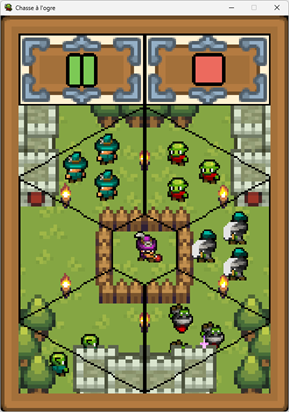
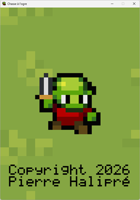
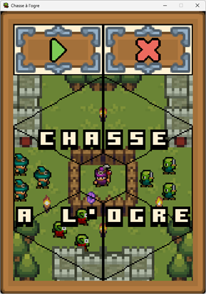
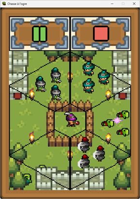
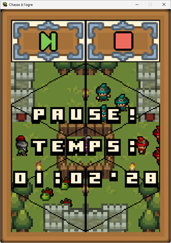
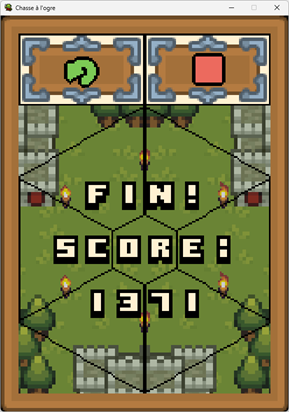

# Chasse à l'ogre

**Chasse à l'ogre** est un simple jeu du type *whac-a-mole* pour Windows.  
Il est développé en Python avec pygame.

## 1. À propos

Vous êtes un magicien dans un royaume, et des ogres viennent vous attaquer...  
Repoussez-les en leur jetant des sorts, mais n'ensorcelez pas les humains !  

## 2. Installation

### 2.1. Pour jouer

Téléchargez puis installez
l'exécutable [chasse-a-l-ogre-python-1.exe](https://github.com/pierre-halipre/chasse-a-l-ogre-python/releases/download/v1/chasse-a-l-ogre-python-1.exe "Exécutable").

> Configuration minimale :
>* ordinateur Windows 10,
>* processeur de 1,44 GHz,
>* 2 Go de RAM,
>* 20 Mo d'espace libre.

### 2.2. Pour développer

Téléchargez puis intégrez le code
source [chasse-a-l-ogre-python-1.zip](https://github.com/pierre-halipre/chasse-a-l-ogre-python/archive/refs/tags/v1.zip "Code source").

> IDE, langage et librairies utilisés :
>* IDLE 3.13.12,
>* Python 3.13.12,
>* pygame 2.6.1,
>* PyInstaller 6.19.0.

## 3. Mode d'emploi

### 3.1. Écran de chargement

L'icône du jeu s'affiche durant le chargement.  

### 3.2. Écran de titre

Le titre est affiché sur la zone de jeu qui est grisée.  
La démonstration du jeu tourne derrière.  
  
Cliquez sur l'icône *jouer* en haut à gauche pour commencer une partie.  
Cliquez sur l'icône *fermer* en haut à droite pour quitter l'application.

### 3.3. Écran de jeu

Le jeu est constituée de sept zones (une centrale et six avoisinantes).  
Au début, le magicien construit sa barricade autour de la zone centrale.
> Le magicien occupe toujours la zone centrale.

Ensuite, les ogres et les humains peuvent venir sur les zones avoisinantes.
> Les ogres ont des visages verts et les humains en ont des blancs.

Cliquez sur une zone lorsque ceux-ci s'y trouvent pour leur jeter un sort.  
Le but est de stopper les ogres sans arrêter les humains.  
À la fin, le magicien déconstruit sa barricade.
> Soyez rapide pour jouer plus longtemps et avoir un score final élevé.

  
Cliquez sur l'icône *pause* en haut à gauche pour mettre la partie en pause.  
Cliquez sur l'icône *stop* en haut à droite pour revenir à l'écran de titre.

### 3.4. Écran de pause

Le temps écoulé est affiché sur la zone de jeu qui est grisée.  
  
Cliquez sur *suivant* en haut à gauche pour reprendre la partie.  
Cliquez sur *stop* en haut à droite pour revenir à l'écran de titre.

### 3.5. Écran de fin

Le score est affiché sur la zone de jeu qui est grisée.  
  
Cliquez sur *rejouer* en haut à gauche pour recommencer une partie.  
Cliquez sur *stop* en haut à droite pour revenir à l'écran de titre.

## 4. Licence

Le programme est distribué sous la licence GPL-3.0 du
fichier [LICENSE.md](./LICENSE.md).  
Certains graphismes et musiques sont attribués sous les licences suivantes :

* "UI Pack - Adventure" by Kenney licensed CC0:  
  https://opengameart.org/content/ui-pack-adventure
* "Game icons" by Kenney licensed CC0:  
  https://opengameart.org/content/game-icons
* "Boxy Bold Font Split" by cemkalyoncu licensed CC0:  
  https://opengameart.org/content/boxy-bold-font-split
* "16x16 Puny World Tileset" by Shade licensed CC0:  
  https://opengameart.org/content/16x16-puny-world-tileset
* "16x16 Puny Dungeon Tileset" by Shade licensed CC0:  
  https://opengameart.org/content/16x16-puny-dungeon-tileset
* "Puny Characters" by Shade licensed CC0:  
  https://opengameart.org/content/puny-characters
* "Overworld Select - 8-bit Gameboy Track" by Wolfgang_ licensed CC-BY 4.0:  
  https://opengameart.org/content/overworld-select-8-bit-gameboy-track
* "NES 8-bit sound effects" by shiru8bit licensed CC-BY 3.0:  
  https://opengameart.org/content/nes-8-bit-sound-effects
* "Free Game GUI" by pzUH licensed CC0:  
  https://opengameart.org/content/free-game-gui
* "Pixel art outlined text fonts" by Vircon32 licensed CC-BY 4.0:  
  https://opengameart.org/content/pixel-art-outlined-text-fonts
* "Adventure Awaits Asset Pack 1.0" by IshtartPixels licensed CC0:  
  https://opengameart.org/content/adventure-awaits-asset-pack-10
* "Mini Fantasy Sprites" by GrafxKid licensed CC0:  
  https://opengameart.org/content/mini-fantasy-sprites
* "Various Creatures" by GrafxKid licensed CC0:  
  https://opengameart.org/content/various-creatures
* "Bonus Round - 8bit" by Wolfgang_ licensed CC0:  
  https://opengameart.org/content/bonus-round-8bit
* "80 CC0 creature SFX" by rubberduck licensed CC0:  
  https://opengameart.org/content/80-cc0-creature-sfx
* "8bit SFX" by celestialghost8 licensed CC0:  
  https://opengameart.org/content/8bit-sfx
* "RPG Asset Pack" by BilouMaster licensed CC-BY 4.0:  
  https://opengameart.org/content/rpg-asset-pack
* "CC0 Book Icons" by AntumDeluge licensed CC0:  
  https://opengameart.org/content/cc0-book-icons
* "box symbols" by mold licensed CC0:  
  https://opengameart.org/content/box-symbols
* "Good Neighbors pixel font" by Clint Bellanger licensed CC0:  
  https://opengameart.org/content/good-neighbors-pixel-font
* "16x16 Simple Fantasy RPG FX" by Emcee Flesher licensed CC0:  
  https://opengameart.org/content/16x16-simple-fantasy-rpg-fx
* "16x16 Fence and Well [Tiny 16]" by William.Thompsonj licensed CC0:  
  https://opengameart.org/content/16x16-fence-and-well-tiny-16
* "16x16 Chibi RPG characters with weapons and Shields" by Emcee Flesher  
  licensed CC-BY 4.0:  
  https://opengameart.org/content/16x16-chibi-rpg-characters-with-weapons-and-shields
* "64 16x16 food sprites" by Sanglorian licensed CC0:  
  https://opengameart.org/content/64-16x16-food-sprites
* "8-bit Haunted House Theme" by Wolfgang_ licensed CC0:  
  https://opengameart.org/content/8-bit-haunted-house-theme
* "NES Sounds" by Baŝto licensed CC0:  
  https://opengameart.org/content/nes-sounds
* "40 Sci Fi NES Sound Effects" by LazyNerdComp licensed GPL 2.0:  
  https://opengameart.org/content/40-sci-fi-nes-sound-effects

> Au cas où, contactez l'auteur
à [https://github.com/pierre-halipre](https://github.com/pierre-halipre).  
> Copyright 2026 Pierre Halipré
