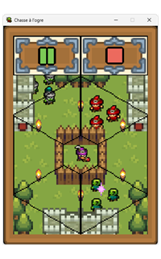
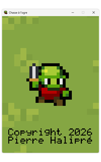
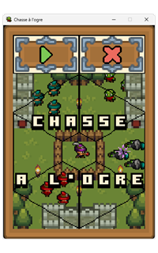
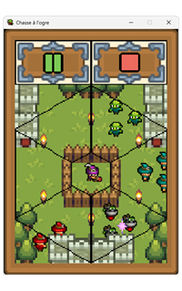
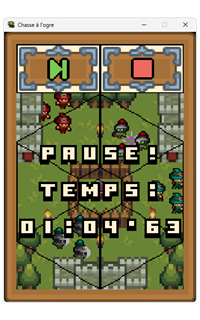
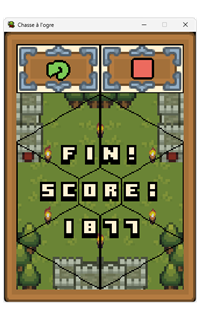

# Chasse à l'ogre

**Chasse à l'ogre** est un simple jeu du type *whac-a-mole*.  
Le programme est développé en Python avec pygame pour Windows.

## 1. À propos

  
Vous êtes un magicien dans un royaume attaqué par des ogres...  
Jetez-leur des sorts pour les repousser !  
Mais des humains viennent vous dire bonjour...  
Faites attention à ne pas les ensorceler !  

## 2. Installation

### 2.1. Pour jouer

Téléchargez le
fichier [chasse_a_l_ogre.exe](https://github.com/pierre-halipre/chasse-a-l-ogre-python/releases/download/v1/chasse_a_l_ogre.exe "chasse_a_l_ogre.exe") sur votre ordinateur.  
Exécutez le fichier.

> La configuration minimale est :
>* un ordinateur avec Windows 10 ;
>* un processeur de 2 GHz ;
>* une RAM de 2 Go ;
>* un espace disque de 20 Mo.

### 2.2. Pour développer

Téléchargez le
dossier [chasse-a-l-ogre-python-1.zip](https://github.com/pierre-halipre/chasse-a-l-ogre-python/archive/refs/tags/v1.zip "chasse-a-l-ogre-python-1.zip") sur votre ordinateur.  
Décompressez le dossier.  
Intégrez le dossier dans votre IDE.

> L'IDE, le langage et les bibliothèques utilisés sont :
>* IDLE 3.13.12 ;
>* Python 3.13.12 ;
>* pygame 2.6.1 ;
>* pycodestyle 2.14.0 ;
>* pylint 4.0.7 ;
>* pyinstaller 6.22.2.

## 3. Mode d'emploi

### 3.1. Écran de chargement

  
L'icône du jeu et les crédits sont affichés sur la fenêtre.

Patientez le temps du chargement.

### 3.2. Écran de menu

  
Le titre du jeu est affiché sur la zone de jeu grisée.  
Une partie de démonstration se joue derrière.  
Deux boutons sont alignés de gauche à droite en haut de la fenêtre.  
L'affichage garde la même disposition sur les autres écrans.

Cliquez sur le bouton :
* *jouer* à gauche pour commencer une partie ;
* *fermer* à droite pour quitter le programme.

### 3.3. Écran de partie

  
La zone de jeu est faite de sept zones dont une centrale et six avoisinantes.  
Le magicien occupe la zone centrale en y construisant sa barricade.  
Les ogres et les humains viennent sur les zones avoisinantes.  
Les ogres ont des visages verts et les humains des blancs.  
Le but est de stopper les ogres au plus vite sans toucher les humains.  
La partie dure en fonction de la performance du magicien.

Cliquez sur une zone occupée par des ogres ou des humains pour les arrêter.  
Cliquez sur le bouton :
* *pause* à gauche pour mettre la partie en pause ;
* *stop* à droite pour quitter la partie et revenir au menu.

### 3.4. Écran de pause

  
Le temps écoulé est affiché sur la zone de jeu grisée.  
La partie est interrompue.

Cliquez sur le bouton :
* *reprise* à gauche pour reprendre la partie ;
* *stop* à droite pour quitter la partie et revenir au menu.

### 3.5. Écran de fin

  
Le score est affiché sur la zone de jeu grisée.  
La partie est terminée.

Cliquez sur le bouton :
* *rejouer* à gauche pour recommencer une partie ;
* *stop* à droite pour revenir au menu.

## 4. Licence

Le programme est distribué selon la licence GPL-3.0-or-later.  
Le texte de la licence se trouve dans le
fichier [LICENSE.md](./LICENSE.md "LICENSE.md").  
Certains éléments sont attribués selon les licences suivantes :
* "UI Pack - Adventure" by Kenney licensed CC0:  
  https://opengameart.org/content/ui-pack-adventure ;
* "Game icons" by Kenney licensed CC0:  
  https://opengameart.org/content/game-icons ;
* "Boxy Bold Font Split" by cemkalyoncu licensed CC0:  
  https://opengameart.org/content/boxy-bold-font-split ;
* "16x16 Puny World Tileset" by Shade licensed CC0:  
  https://opengameart.org/content/16x16-puny-world-tileset ;
* "16x16 Puny Dungeon Tileset" by Shade licensed CC0:  
  https://opengameart.org/content/16x16-puny-dungeon-tileset ;
* "Puny Characters" by Shade licensed CC0:  
  https://opengameart.org/content/puny-characters ;
* "Overworld Select - 8-bit Gameboy Track" by Ted Kerr licensed CC-BY 4.0:  
  https://opengameart.org/content/overworld-select-8-bit-gameboy-track ;
* "NES 8-bit sound effects" by shiru8bit licensed CC-BY 3.0:  
  https://opengameart.org/content/nes-8-bit-sound-effects ;
* "Free Game GUI" by pzUH licensed CC0:  
  https://opengameart.org/content/free-game-gui ;
* "Pixel art outlined text fonts" by Vircon32 (Carra) licensed CC-BY 4.0:  
  https://opengameart.org/content/pixel-art-outlined-text-fonts ;
* "Adventure Awaits Asset Pack 1.0" by IshtartPixels licensed CC0:  
  https://opengameart.org/content/adventure-awaits-asset-pack-10 ;
* "Mini Fantasy Sprites" by GrafxKid licensed CC0:  
  https://opengameart.org/content/mini-fantasy-sprites ;
* "Various Creatures" by GrafxKid licensed CC0:  
  https://opengameart.org/content/various-creatures ;
* "Bonus Round - 8bit" by Wolfgang_ licensed CC0:  
  https://opengameart.org/content/bonus-round-8bit ;
* "80 CC0 creature SFX" by rubberduck licensed CC0:  
  https://opengameart.org/content/80-cc0-creature-sfx ;
* "8bit SFX" by celestialghost8 licensed CC0:  
  https://opengameart.org/content/8bit-sfx ;
* "RPG Asset Pack" by BilouMaster licensed CC-BY 4.0:  
  https://opengameart.org/content/rpg-asset-pack ;
* "CC0 Book Icons" by AntumDeluge licensed CC0:  
  https://opengameart.org/content/cc0-book-icons ;
* "box symbols" by mold licensed CC0:  
  https://opengameart.org/content/box-symbols ;
* "Good Neighbors pixel font" by Clint Bellanger licensed CC0:  
  https://opengameart.org/content/good-neighbors-pixel-font ;
* "16x16 Simple Fantasy RPG FX" by Emcee Flesher licensed CC0:  
  https://opengameart.org/content/16x16-simple-fantasy-rpg-fx ;
* "16x16 Fence and Well [Tiny 16]" by William.Thompsonj licensed CC0:  
  https://opengameart.org/content/16x16-fence-and-well-tiny-16 ;
* "16x16 Chibi RPG characters with weapons and shields" by Emcee Flesher  
  licensed CC-BY 4.0:  
  https://opengameart.org/content/16x16-chibi-rpg-characters-with-weapons-and-shields ;
* "64 16x16 food sprites" by Sanglorian licensed CC0:  
  https://opengameart.org/content/64-16x16-food-sprites ;
* "8-bit Haunted House Theme" by Wolfgang_ licensed CC0:  
  https://opengameart.org/content/8-bit-haunted-house-theme ;
* "NES Sounds" by Baŝto licensed CC0:  
  https://opengameart.org/content/nes-sounds ;
* "40 Sci Fi NES Sound Effects" by LazyNerdComp licensed GPL 2.0:  
  https://opengameart.org/content/40-sci-fi-nes-sound-effects.

> Contactez l'auteur à [pierre.halipre@mailo.com](mailto:pierre.halipre@mailo.com) pour toute information.  
> Copyright 2026 Pierre Halipré